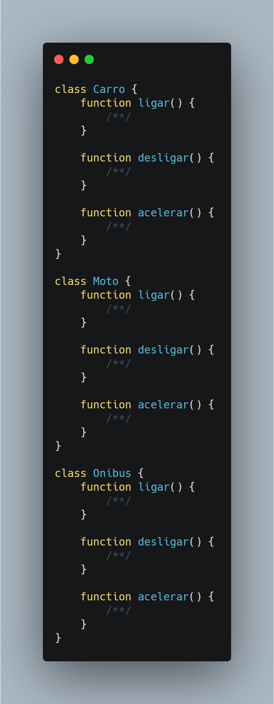
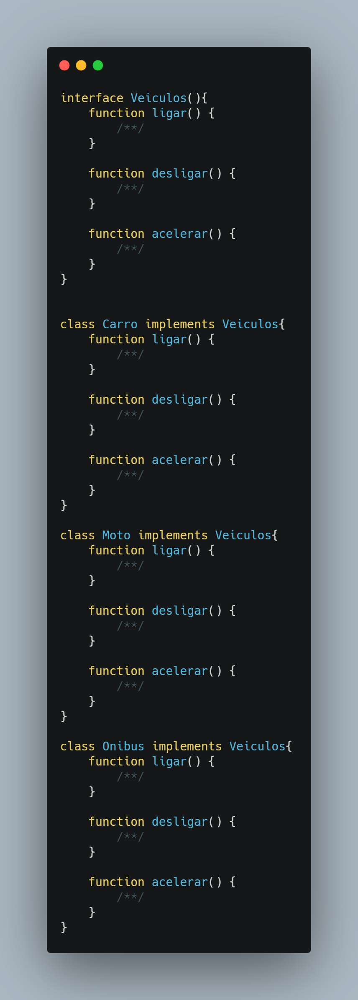

</>

👤 **Matheus S. Gomes** 

* Website: https://matheus.sgomes.dev
* Github: [@Matheussg42](https://github.com/Matheussg42)
* LinkedIn: [@matheussg](https://linkedin.com/in/matheussg)

---

## Projeto

Este projeto foi criado com a finalidade de falar sobre os 5 princípios do SOLID, onde através de explicações e exemplo irei tentar explicar o que são e como cada princípio funciona.

LETRA       | SIGLA     | NOME                                  | RESUMO
------------|-----------|---------------------------------------|------------
S           | SRP       | Principio da Responsabilidade Única   | Uma classe deve ter um, e somente um, motivo para mudar.
O           | OCP       | Princípio Aberto-Fechado              | Você deve ser capaz de estender um comportamento de uma classe, sem modificá-lo.
L           | LSP       | Princípio da Substituição de Liskov   | As classes base devem ser substituíveis por suas classes derivadas.
I           | ISP       | Princípio da Segregação da Interface  | Muitas interfaces específicas são melhores do que uma interface única.
**D**           | **DIP**       | **Princípio da inversão da dependência**  | **Dependa de uma abstração e não de uma implementação.**

Acesse os princípios a seguir:
 
* S -> <a href="/SRP">Principio da Responsabilidade Única</a>
* O -> <a href="/OCP">Princípio Aberto-Fechado</a>
* L -> <a href="/LSP">Princípio da Substituição de Liskov</a>
* I -> <a href="/ISP">Princípio da Segregação da Interface</a>
* **D -> <a href="/DIP">Princípio da inversão da dependência</a>**

## Princípio da inversão da dependência

O **D** de SOLI**D** é de Dependency inversion principle (ou Princípio da inversão da dependência), que tem como objetivo orientar o desenvolvedor para que ao criar algum sistema, este dependa de interfaces ou classes abstratas, ao invés de classes concretas.

> Módulos de alto nível não devem depender de módulos de baixo nível. Ambos devem depender de abstrações; Abstrações não devem depender de detalhes. Detalhes devem depender de abstrações. (MARTIN 1996)

---

### Exemplo

Digamos que temos as classes `Carro`, `Carro` e `Onibus`, todas as três classes possuem as funções `ligar()`, `desligar()` e `acelerar()`.

E com isso, podemos criar uma interface `Veiculos` para conter essas funções, e usar a interface nas classes.

