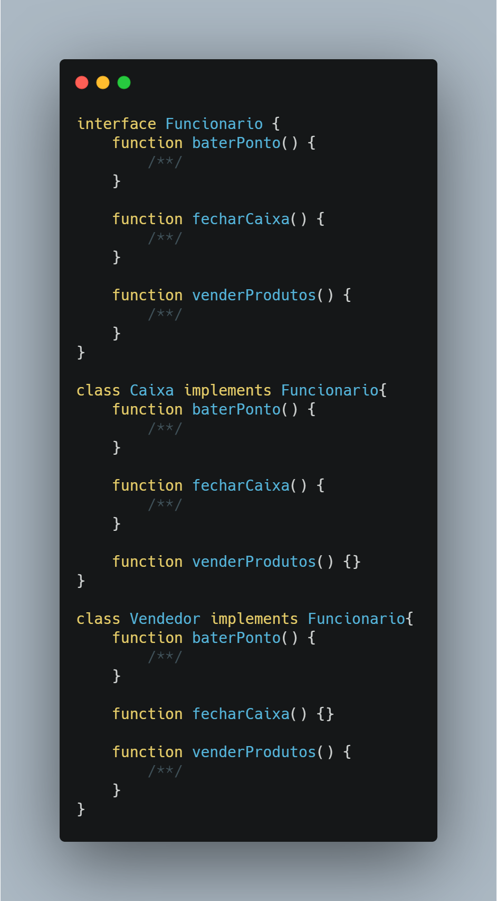
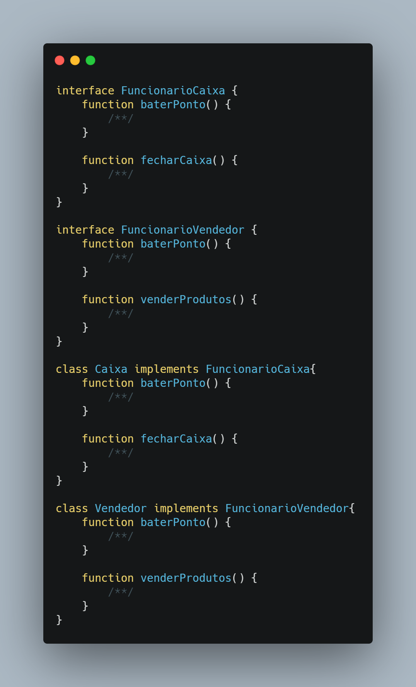

</>

👤 **Matheus S. Gomes** 

* Website: https://matheus.sgomes.dev
* Github: [@Matheussg42](https://github.com/Matheussg42)
* LinkedIn: [@matheussg](https://linkedin.com/in/matheussg)

---

## Projeto

Este projeto foi criado com a finalidade de falar sobre os 5 princípios do SOLID, onde através de explicações e exemplo irei tentar explicar o que são e como cada princípio funciona.

LETRA       | SIGLA     | NOME                                  | RESUMO
------------|-----------|---------------------------------------|------------
S           | SRP       | Principio da Responsabilidade Única   | Uma classe deve ter um, e somente um, motivo para mudar.
O           | OCP       | Princípio Aberto-Fechado              | Você deve ser capaz de estender um comportamento de uma classe, sem modificá-lo.
L           | LSP       | Princípio da Substituição de Liskov   | As classes base devem ser substituíveis por suas classes derivadas.
**I**           | **ISP**      | **Princípio da Segregação da Interface**  | **Muitas interfaces específicas são melhores do que uma interface única.**
D           | DIP       | Princípio da inversão da dependência  | Dependa de uma abstração e não de uma implementação.

Acesse os princípios a seguir:
 
* S -> <a href="/SRP">Principio da Responsabilidade Única</a>
* O -> <a href="/OCP">Princípio Aberto-Fechado</a>
* L -> <a href="/LSP">Princípio da Substituição de Liskov</a>
* **I -> <a href="/ISP">Princípio da Segregação da Interface</a>**
* D -> <a href="/DIP">Princípio da inversão da dependência</a>

## Princípio da Segregação da Interface

O **I** de SOL**I**D é de Interface Segregation Principle (ou Princípio da Segregação da Interface), afirma que nenhuma classe deve ser forçada a implementar métodos que não utiliza. Com isso `Princípio da Segregação da Interface` diz para separar uma interface grande e interfaces menores e mais especificas.

---

### Exemplo

Vamos supor que uma loja tem um sistema, e esse sistema possui uma interface `Funcionario` com as funções `baterPonto()`, `fecharCaixa()` e `venderProdutos()`. Vamos imaginar que o sistema também possui as classes `Caixa` e `Vendedor`, e ambas dão um `implements` na interface `Funcionario`.

Aqui podemos ver que as classes `Caixa` e `Vendedor` implementam funções que não necessárias para elas(`venderProdutos()` e `fecharCaixa()` respectivamente). Aplicando `Princípio da Segregação da Interface` nós separamos `Funcionario` em interfaces menores para poder atender melhor as classes de `Caixa` e `Vendedor`.

