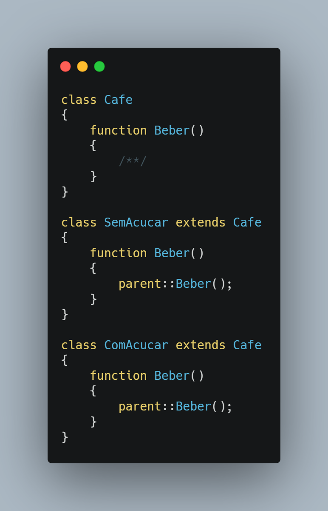
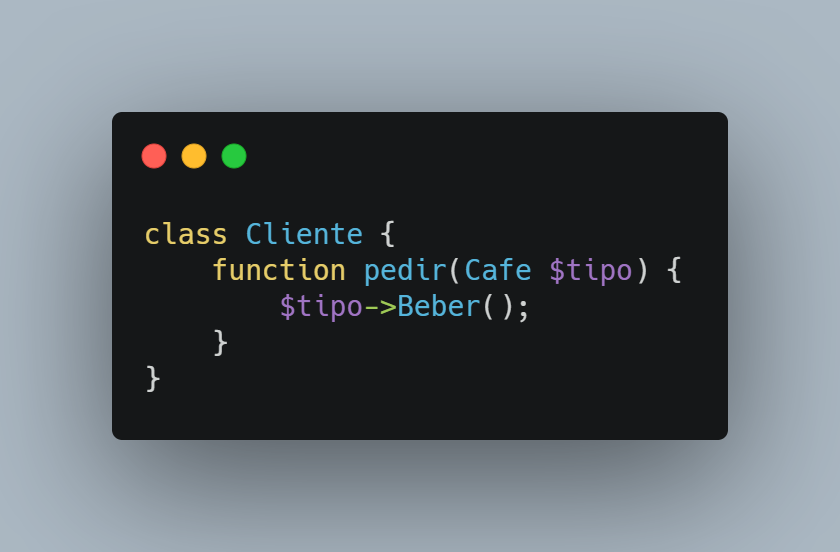

</>

👤 **Matheus S. Gomes** 

* Website: https://matheus.sgomes.dev
* Github: [@Matheussg42](https://github.com/Matheussg42)
* LinkedIn: [@matheussg](https://linkedin.com/in/matheussg)

---

## Projeto

Este projeto foi criado com a finalidade de falar sobre os 5 princípios do SOLID, onde através de explicações e exemplo irei tentar explicar o que são e como cada princípio funciona.

LETRA       | SIGLA     | NOME                                  | RESUMO
------------|-----------|---------------------------------------|------------
S           | SRP       | Principio da Responsabilidade Única   | Uma classe deve ter um, e somente um, motivo para mudar.
O           | OCP       | Princípio Aberto-Fechado              | Você deve ser capaz de estender um comportamento de uma classe, sem modificá-lo.
**L**           | **LSP**       | **Princípio da Substituição de Liskov**   | **As classes base devem ser substituíveis por suas classes derivadas.**
I           | ISP       | Princípio da Segregação da Interface  | Muitas interfaces específicas são melhores do que uma interface única.
D           | DIP       | Princípio da inversão da dependência  | Dependa de uma abstração e não de uma implementação.

Acesse os princípios a seguir:
 
* S -> <a href="/SRP">Principio da Responsabilidade Única</a>
* O -> <a href="/OCP">Princípio Aberto-Fechado</a>
* **L -> <a href="/LSP">Princípio da Substituição de Liskov</a>**
* I -> <a href="/ISP">Princípio da Segregação da Interface</a>
* D -> <a href="/DIP">Princípio da inversão da dependência</a>

## Princípio da Substituição de Liskov

O **L** de SO**L**ID é de Liskov Substitution Principle (ou Princípio da Substituição de Liskov). Esse princípio foi por **`Barbara Liskov`**, e diz que qualquer `subclasses` pode substituir sua classe `base`, e mesmo assim, fazer com que as funcionalidades não quebrem.  

> Se q(x) é uma propriedade demonstrável dos objetos x de tipo T. Então q(y) deve ser verdadeiro para objetos y de tipo S onde S é um subtipo de T.

---

### Exemplo

Vamos imaginar que temos uma classe base chamada `Cafe` com uma função chamada `beber()`, e ao mesmo tempo temos as classes `SemAcucar` e `ComAcucar` que dão um **`extends`** na classe `Cafe`.

Caso tenha uma classe `Cliente`, ele poder usar tanto `Cafe`, `SemAcucar` e `ComAcucar` sem quebrar a funcionalidade.

