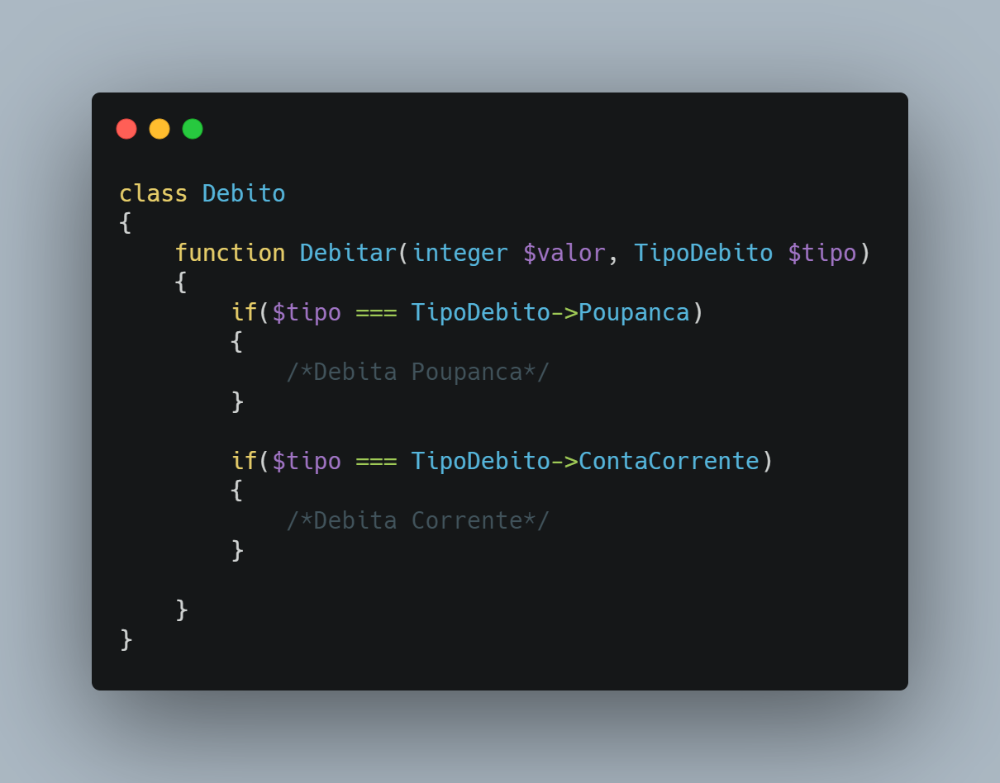
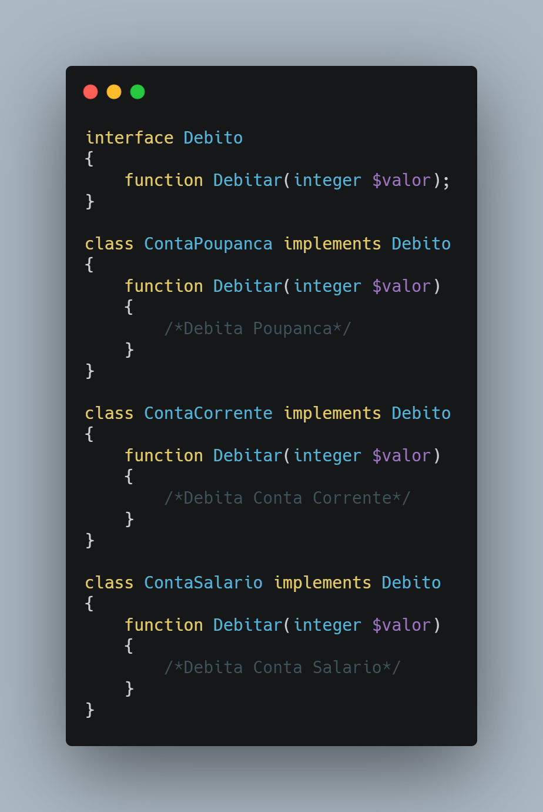

</>

👤 **Matheus S. Gomes** 

* Website: https://matheus.sgomes.dev
* Github: [@Matheussg42](https://github.com/Matheussg42)
* LinkedIn: [@matheussg](https://linkedin.com/in/matheussg)

---

## Projeto

Este projeto foi criado com a finalidade de falar sobre os 5 princípios do SOLID, onde através de explicações e exemplo irei tentar explicar o que são e como cada princípio funciona.

LETRA       | SIGLA     | NOME                                  | RESUMO
------------|-----------|---------------------------------------|------------
S           | SRP       | Principio da Responsabilidade Única   | Uma classe deve ter um, e somente um, motivo para mudar.
**O**           | **OCP**       | **Princípio Aberto-Fechado**              | **Você deve ser capaz de estender um comportamento de uma classe, sem modificá-lo.**
L           | LSP       | Princípio da Substituição de Liskov   | As classes base devem ser substituíveis por suas classes derivadas.
I           | ISP       | Princípio da Segregação da Interface  | Muitas interfaces específicas são melhores do que uma interface única.
D           | DIP       | Princípio da inversão da dependência  | Dependa de uma abstração e não de uma implementação.

Acesse os princípios a seguir:
 
* S -> <a href="/SRP">Principio da Responsabilidade Única</a>
* **O -> <a href="/OCP">Princípio Aberto-Fechado</a>**
* L -> <a href="/LSP">Princípio da Substituição de Liskov</a>
* I -> <a href="/ISP">Princípio da Segregação da Interface</a>
* D -> <a href="/DIP">Princípio da inversão da dependência</a>

## Princípio Aberto-Fechado 

O **O** de S**O**LID é de Open-closed Principle (ou Princípio Aberto-Fechado), tem o objetivo de orientar o desenvolvedor a seguir a premissa da entidade estar aberta para extensão, porém fechadas para modificação.

> Entidades de software (classes, módulos, funções, etc.) devem ser abertas para extensão, mas fechadas para modificação. — Bertrand Meyer

Podemos considerar que para seguir esse princípio, as nossas classes deveriam poder ter seu comportamento alterado, porém se alteração em seu código fonte original. Isso pode ser feito através de `herança` ou `interface ` por exemplo.

---

### Exemplo

Vamos imaginar que em um sistema de conta digital, nós temos uma classe chamada `Debito`, e nesta classe nós temos uma função chamada `debitar()`. 

Caso o sistema passe a aceitar conta salário, teríamos que alterar e adicionar mais um `if` na função `debitar()`, e isso iria ferir o `Princípio Aberto-Fechado`. A solução seria transformar a classe `Debito` em uma **interface**, e criar as classes `ContaPoupanca`, `ContaCorrente` e `ContaSalario` implementando a interface `Debito`.

Assim `Debito` está aberta para extensão, porém não para novas implementações em seu código-fonte.