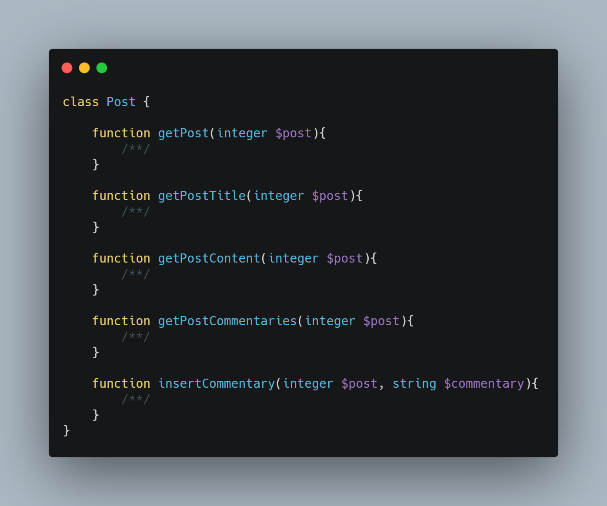
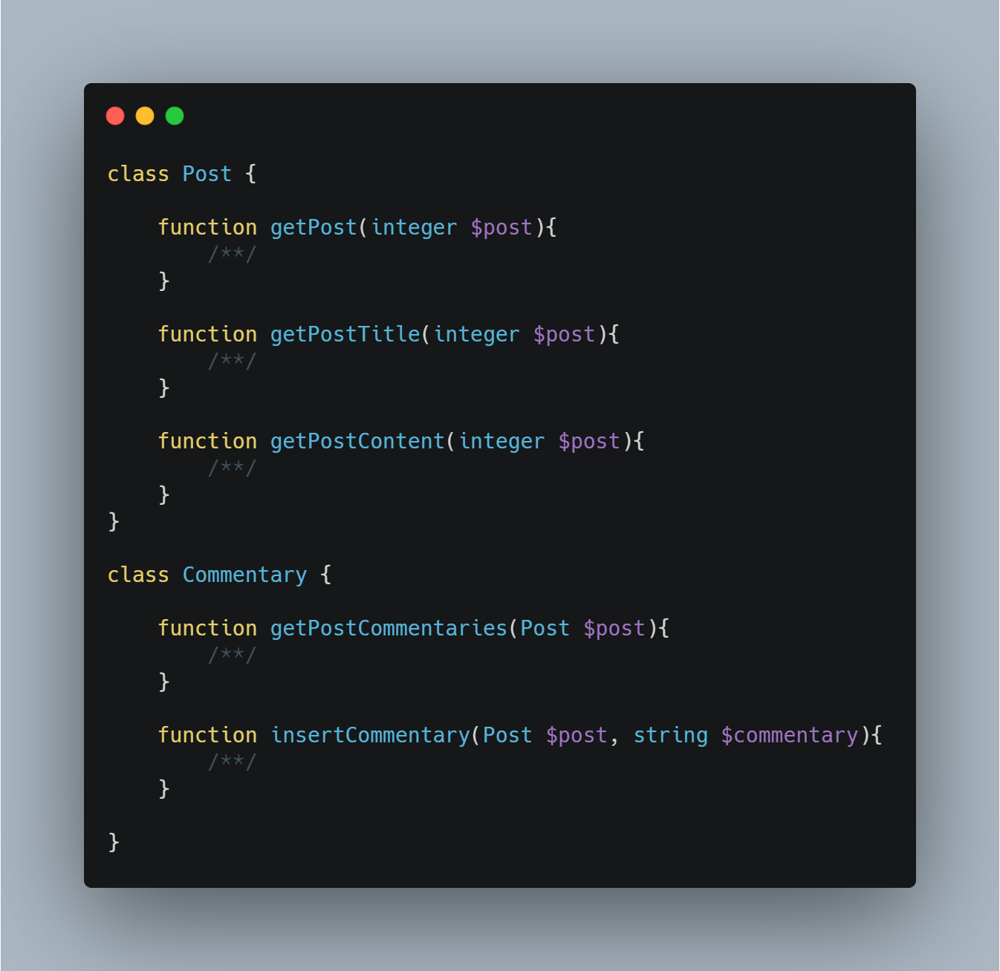

</>

👤 **Matheus S. Gomes** 

* Website: https://matheus.sgomes.dev
* Github: [@Matheussg42](https://github.com/Matheussg42)
* LinkedIn: [@matheussg](https://linkedin.com/in/matheussg)

---

## Projeto

Este projeto foi criado com a finalidade de falar sobre os 5 princípios do SOLID, onde através de explicações e exemplo irei tentar explicar o que são e como cada princípio funciona.

LETRA       | SIGLA     | NOME                                  | RESUMO
------------|-----------|---------------------------------------|------------
**S**       | **SRP**   | **Principio da Responsabilidade Única**   | **Uma classe deve ter um, e somente um, motivo para mudar.**
O           | OCP       | Princípio Aberto-Fechado              | Você deve ser capaz de estender um comportamento de uma classe, sem modificá-lo.
L           | LSP       | Princípio da Substituição de Liskov   | As classes base devem ser substituíveis por suas classes derivadas.
I           | ISP       | Princípio da Segregação da Interface  | Muitas interfaces específicas são melhores do que uma interface única.
D           | DIP       | Princípio da inversão da dependência  | Dependa de uma abstração e não de uma implementação.

Acesse os princípios a seguir:
 
* **S -> <a href="/SRP">Principio da Responsabilidade Única</a>**
* O -> <a href="/OCP">Princípio Aberto-Fechado</a>
* L -> <a href="/LSP">Princípio da Substituição de Liskov</a>
* I -> <a href="/ISP">Princípio da Segregação da Interface</a>
* D -> <a href="/DIP">Princípio da inversão da dependência</a>

## Principio da Responsabilidade Única

O **S** de **S**OLID é de Single responsibility principle (ou Princípio da responsabilidade única), é responsável por não 'permitir' que as classes se mantenha com uma única responsabilidade, assim não formando as chamadas God Class. Caso a classe tenha mais de um objetivo, é aconselhado separa-la para manter essa 'responsabilidade única'.

---

### Exemplo

Vamso imaginar que em um blog, nós temos uma classe chamada `Post`, e nesta classe nós temos as funções `getPost()`, `getPostTitle()`, `getPostContent()`, `getPostCommentaries()` e `insertCommentary()`. 

Aqui podemos perceber que além das funções de **post** temos duas funções de **comentário**. E o que poderiamos fazer? Isso Mesmo! Aplicar o **Principio da Responsabilidade Única** e separar estas classes.

Assim a classe `Post` tem a responsabilidade de cuidar somente do que é do post, e a classe de `Commentary` com a responsabilidade dos comentários.